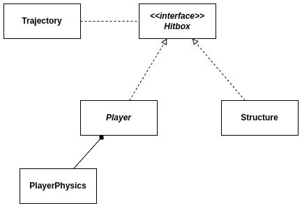
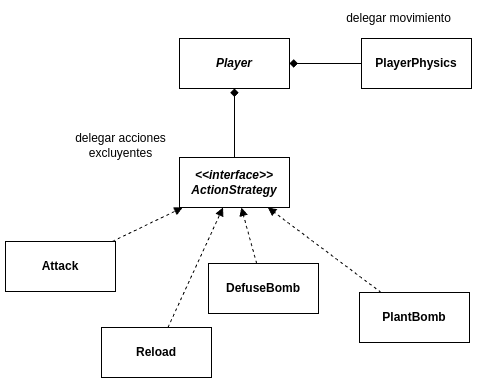

# documentación técnica de cs2d

## Server
El servidor está constituido principalmente por dos módulos o responsabilidades principales: *network* y *world* (`world/`). Network refiere a la gestión de los sockets, a la comunicación con los clientes, mientras que world se encarga de gestionar la lógica de negocio del juego.

### Network
La arquitectura de comunicación con el otro módulo (client) del server es muy similar a la de client para con server. Hay dos threads, uno para enviar mensajes y otro para recibirlos, éstos son `Sender` y `Receiver`, ambos tienen una referencia a la `Connection` del *handler* que los posea.
En server existen dos tipos de handlers: - `ClientHandler` y - `PlayerHandler`; que se encargan de la comunicación con el cliente durante las etapas de lobby y partida respectivamente.

### World
Si bien la lógica de negocio que debe contemplar el módulo world para cumplir con sus responsabilidades es amplia, la mayor parte de su complejidad radica en el motor de físicas del juego: éste es el que se encarga de checkear colisiones entre jugadores y entre balas y jugadores; ésto último se implementa a groso modo de la siguiente manera:

#### Colisiones
Para las colisiones, se usa la interfaz `Hitbox`. La misma declara dos métodos abstractos:
- `std::optional<Position> intersect(const Trajectory& t)` y
- `void get_attacked(int damage)`;

que son lo que uno intuitivamente esperaría de una hitbox: una caja que tiene cierto volumen físico y que puede ser *golpeada*.

`Trajectory` representa un rectángulo de extremidades redondeadas, la estructura de por sí es un simple segmento de recta con origen, destino y longitud, pero responde al método `std::pair<Position, Position> get_outter_inner_closest(const Position& pos)`, que retorna dos posiciones: las proeyecciones de la posición `pos` que se pasa por parámetro a la función sobre el *caparazón* de la recta de la trayectoria, es decir, el rectángulo de extremos redondeados que mencionamos antes, y sobre la recta real o interna de la trayectoria; el esqueleto o trayectoria desinflada. La idea de éste método (y en general de ésta clase), es que los colisionables puedan llamarlo con su posición central y checkear que `outter_closest` (el `first` del `std::pair`) sea menor a su volumen en la dirección de la trayectoria, caso en el que sí hay colisión, y retornar en ese caso el punto de intersección de ésta trayectoria sobre la figura. Para el caso de las hitbox de los jugadores, se usa un círculo en el motor de físicas del juego, entonces el la condición de colisión se convierte en:
```cpp
std::optional<Position> PlayerPhysics::intersect(const Trajectory& t) {
    auto closest = t.get_outter_inner_closest(pos);
    float distance_to_closest = pos.get_distance(closest.first) > radius;
    if (distance_to_closest > radius) return std::nullopt; // no hay intersección
    // ...
```

y la intersección a retornar si se pasa del checkeo en:
```cpp
    // ...
    Position intersection = pos + pos.get_direction(closest.second) * radius;
    return intersection;
}
```

Quien conserva éstas interfaces es `Map`, que responde, cada vez que alguna entidad quira hacer algo que pueda llegar a colisioanr con una hitbox, al método `std::vector<std::shared_ptr<Hitbox>>& get_collidables()`.

##### Arquitectura de alto nivel de las físicas del jugador


#### Acciones del jugador
Para las acciones del jugador, usamos el patrón de diseño *Command*: los comandos que llegan por socket se ejecutan en `PlayerHandler`:
```cpp
void PlayerHandler::play() {
    std::unique_ptr<DTO> dto;
    if (commands.try_pop(dto)) {
        std::unique_ptr<Command> cmd = constructor.construct(std::move(dto));
        cmd->execute(*player);
    }
}
```

En el modelo hay dos tipos de comandos:
- *comandos pasivos*: le indican al jugador *lo que está haciendo*, es decir, modifican su estado en un instante de tiempo para que el mismo se siga actualizando con la propagación de las llamadas a `World::update(float dt)`, a diferencia de los
- *comandos activos*: que pueden ejecutarse inmediatamente, sin necesidad de esperar a que el juego se actualice en con un delta de tiempo.
La razón por la cuál utilizamos comandos pasivos es para no saturar al servidor de mensajes innecesarios de aquellos comandos que se sostienen en el tiempo, tal es el caso de los comandos de movimiento (el usuario generalmente mantiene oprimida la tecla `w` si quiere moverse hacia *adelante*), o de disparo (ante el uso de armas automáticas, los usuarios no se detienen a pulsar el *click* reiteradas veces para disparar).

En cuanto a la implementación de las capacidades de `Player` en los `execute` de los comandos, se resuelve el problema usando el patrón de diseño *Strategy*: el jugador tiene un atributo polimórfico al que le delega la ejecución de las acciones. No confundir ésta categoría de métodos de `Player` con sus físicas, pues las acciones que implementan la interfaz `ActionStrategy` son excluyentes, no así con la ejecución de los `update` de `PlayerPhysics`.


##### Arquitectura de alto nivel de las acciones del jugador

