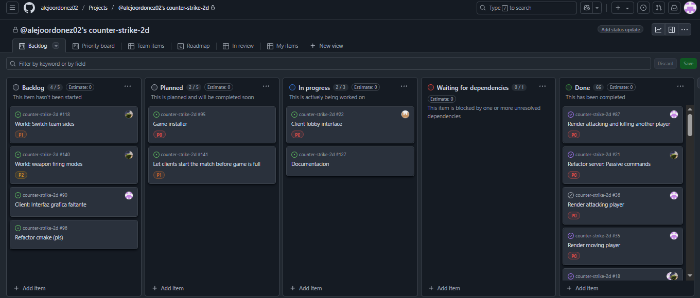

## Manual del proyecto

## Integrantes
Alejo Ordoñez - 108397
Weng Xu Marcos Tomás - 109153
Alejandro Paff - 103376
Gonzalo Bustos - 100827

## División de trabajo
Al ser un TP tan grande la división de tareas fué fundamental, cada uno se encargó de una parte del proyecto.
Alejo -> Servidor y logica del juego.
Gonzalo -> Protocolo y coordinación de lógica.
Marcos -> Editor de niveles y lobby con QT
Alejandro -> Interfaz grafica con SDL

## Organización por semana

### Semana 1 (6/5 al 13/5)
Esta semana fué caótica ya que muchos de los integrantes reprobaron el TP anterior de threads, haciendo que haya muchas bajas y nos debamos juntar dos grupos de dos personas para formar éste. Integramos los diagramas e ideas que teníamos en los grupos originales para llegar a un acuerdo respecto a la planificación, diseño y división de tareas.

### Semana 2 (13/5 al 20/5)
Durante esta semana logramos implementar una interfaz gráfica básica utilizando SDL. Marcos comenzó con la estructura del editor de mapas en QT, mientras que Alejo y Gonzalo establecieron los primeros paquetes de comunicación y el esqueleto del servidor, junto a tests ya que aún no era posible testear client y server. Se definieron las estructuras DTOs para mensajes y se comenzaron a serializar los datos.

### Semana 3 (20/5 al 27/5)
Esta semana se caracterizó por una gran cantidad de avances paralelos. Alejo implementó una gran parte de la lógica de juego: movimiento de jugadores, direcciones, colisiones, trayectoria de proyectiles, y operadores para facilitar cálculos espaciales. También comenzó a incorporar estructuras de pruebas automatizadas. Gonzalo desarrolló avances clave en el protocolo de comunicación y estructuras internas como Queue y Sender. Alejandro logró mostrar los primeros elementos visuales del juego en SDL y se enfocó en el GameLoop y el renderizado de fondo y jugador. Marcos completó una versión funcional básica del editor de mapas y comenzó la carga y guardado de archivos con tiles. Además, se escribieron los primeros borradores del manual y se consolidaron varias ramas con merges importantes

### Semana 4 (27/5 al 3/6) - Entrega parcial
Se avanzó en la primera etapa con la integración del servidor y cliente, permitiendo movimientos básicos. Gonzalo completó la estructura del protocolo y Alejo comenzó a trabajar en el GameLoop. Alejandro implementó renderización de mapas, efectos visuales iniciales. Marcos integró operaciones del lobby desde QT y preparó el editor para cargar mapas desde YAML.

### Semana 5 (3/6 al 10/6)
Logramos conectar clientes con el servidor y mover personajes en un mapa cargado desde archivo. Alejo implementó parte del sistema de colisiones y Gonzalo una cola de eventos sincronizada. Se presentaron problemas con SDL relacionados al framerate y sincronización, que Alejandro logró mitigar. Marcos mejoró la interfaz de lobby. Comenzamos pruebas de mensajes múltiples simultáneos.

### Semana 6 (10/6 al 17/6)
Esta semana se agregaron nuevas funcionalidades: armas en el suelo, compra y recarga. Alejandro trabajó en efectos visuales como el HUD de armas y munición y una generalización del mismo. Alejo consolidó la lógica de juego (bombas, victoria por equipo, etc). Gonzalo unificó los DTOs y mejoró la estructura de SnapshotDTO. Marcos terminó la integración del lobby y agregó opciones de selección.

### Semana 6 (10/6 al 17/6) - Entrega final
En la última semana se integraron todos los componentes: audio con SDL_Mixer por Alejandro, mejoras visuales finales, sincronización final de mensajes, y estabilidad general. Alejo depuró el servidor y ajustó configuraciones de balanceo, asi como la implementación de armas en el suelo y todo lo faltante. Gonzalo aseguró la coordinación del ciclo de vida del juego. Marcos cerró detalles visuales del editor y configuración.

### Dificultades encontradas
- Coordinación entre cliente y servidor
- Sincronización de comandos y estado del juego.
- Framerate del cliente y su sincronización con los estados del server
- Planteación del diseño en general, tanto del lado del server, como client y editor. Ya que al ser tantas cosas se requeria pensarlo bien.

### Herramientas
La mayoría utilizó VSCode como IDE principal. 
Algunos utilizaron una maquina virtual en un entorno Windows para desarrollar, el VSCode permite conectarse remotamente a una maquina por lo cual se puede utilizar las funcionalidades desde el equipo host. Otros utilizaron un sistema linux nativo.
Tambien utilizamos Github Proyects para coordinar y organizarnos mediante un tablero Kanban, donde permitía un trabajo asincronico y coordinado

### Conclusión
El trabajo fue desafiante y la experiencia sirvió para mejorar habilidades de programación en C++ y coordinación de proyectos en equipo.

### Notas finales
Si tuvieramos que hacer el TP de nuevo posiblemente arrancariamos con una mayor organización durante las primeras semanas, aunque resulte muy dificil es posible con una buena comunicación y equipo.
